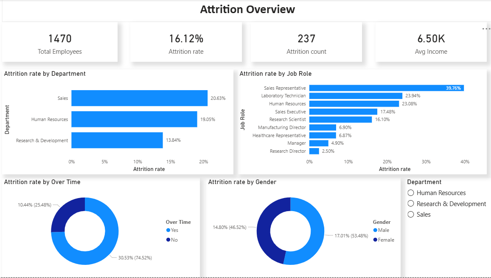
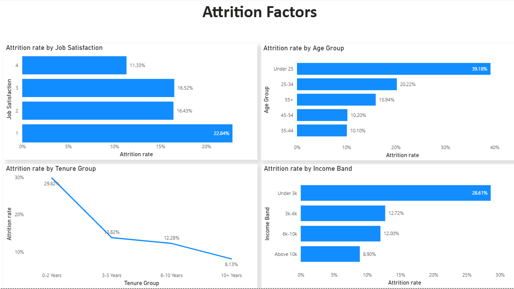

# HR Analytics: Employee Attrition & Performance 

## Overview

This project analyzes the IBM HR Analytics Employee Attrition dataset to understand key factors driving employee turnover. The goal is to identify patterns in attrition and provide actionable insights to help organizations improve employee retention and workforce stability.

## Business Problem

Employee attrition is a major challenge for organizations, leading to increased hiring costs and loss of productivity.

This project aims to answer:

- Which employees are most likely to leave?
- What factors influence attrition the most?
- How can organizations reduce employee turnover?

## Key Questions Addressed

1. Which job roles have the highest attrition rate?
2. Does low job satisfaction lead to higher attrition?
3. Does overtime correlate with higher attrition?
4. Which department has the highest attrition rate?
5. Does monthly income affect attrition — are lower-paid employees leaving more?

## Dataset

- Source: IBM HR Analytics Employee Attrition & Performance Dataset  
- Total Employees: 1470  
- Features: Job Role, Department, Monthly Income, Job Satisfaction, Overtime, Attrition, etc.

## Dashboard Overview

### 1. Attrition Overview
- Overall attrition rate and employee distribution
- Attrition by department and job role
- Attrition split by gender and overtime

### 2. Attrition Factors
- Attrition by job satisfaction levels
- Attrition by age group
- Attrition by income bands
- Attrition by tenure

## Key Insights

- **High Attrition in Specific Job Roles**  
  Sales Representatives have the highest attrition rate at **39.76%**, significantly above the overall average of **16.12%**, indicating role-specific challenges.

- **Job Satisfaction is a Major Driver**  
  Employees with the lowest job satisfaction (Level 1) show **22.84% attrition**, nearly double the overall rate, highlighting the importance of employee engagement.

- **Overtime Strongly Correlates with Attrition**  
  Employees working overtime have a **25.48% attrition rate** compared to **14.80%** for those who do not, suggesting workload and burnout as key factors.

- **Income Level Impacts Retention**  
  Employees earning under ₹3K per month have the highest attrition at **28.61%**, while those earning above ₹10K show only **8.90%**, indicating compensation plays a critical role.

- **Early Tenure is High-Risk Period**  
  Employees with **0–2 years of tenure** show **29.82% attrition**, suggesting onboarding and early-career support need improvement.

## Tools & Techniques Used

- Power BI (Data Modeling, DAX, Visualization)
- Data Cleaning & Transformation (Power Query)
- KPI Cards, Bar Charts, Donut Charts, Slicers

## Conclusion

The analysis highlights that attrition is primarily driven by job satisfaction, workload (overtime), compensation, and role-specific factors. Organizations can reduce attrition by improving employee engagement, optimizing workload, and revisiting compensation strategies.
