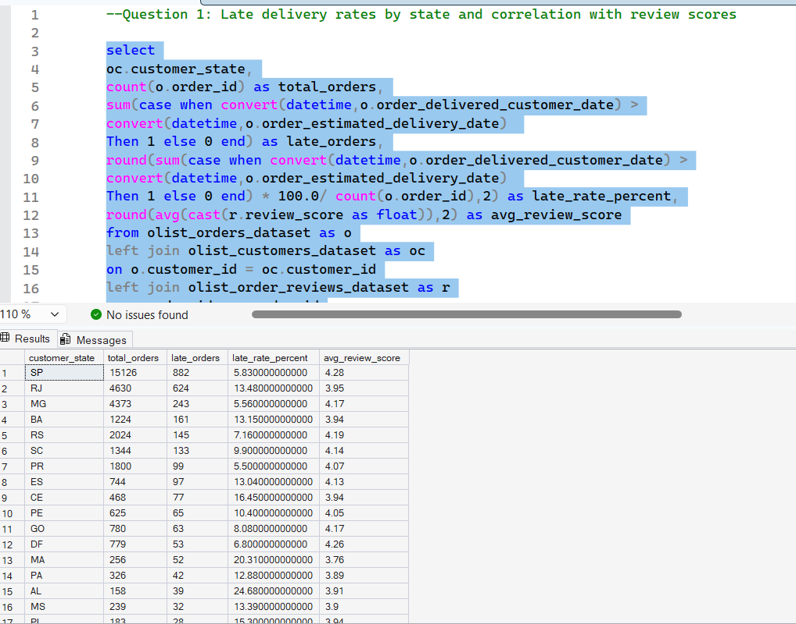
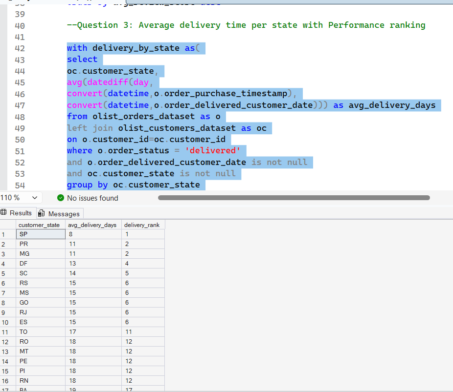
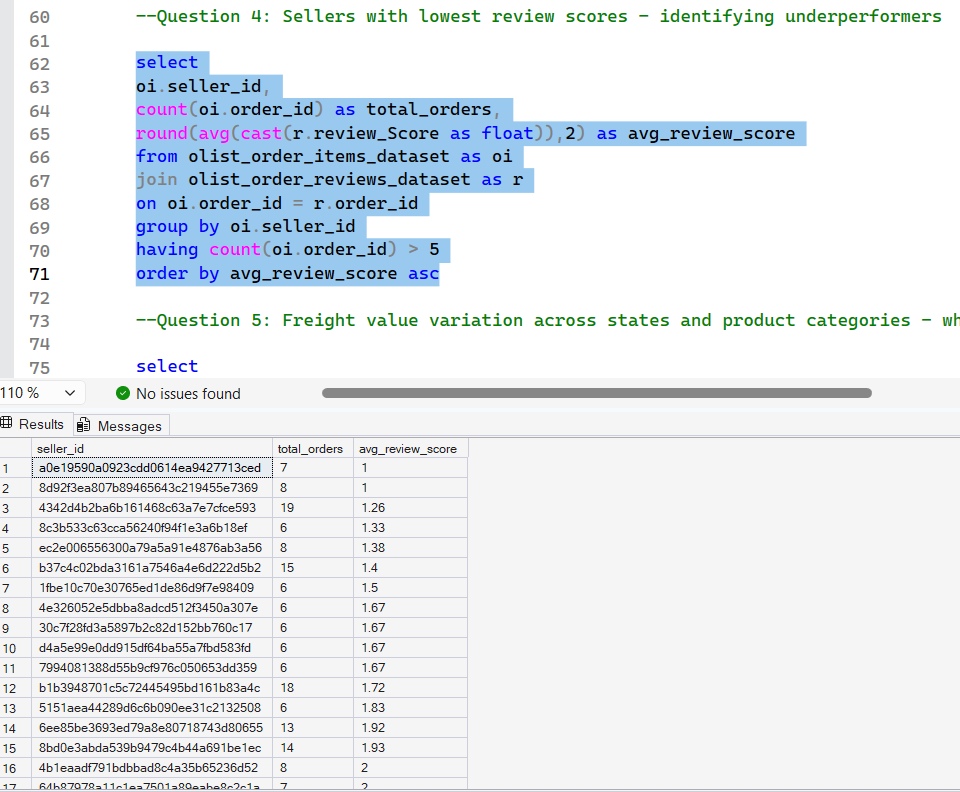
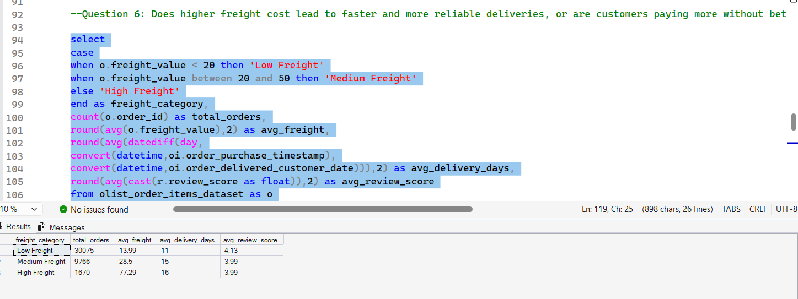

# Olist E-commerce Delivery & Seller Performance Analysis

## Overview

This project analyzes the Brazilian Olist e-commerce dataset (100k+ orders from 2016–2018) to evaluate delivery performance, customer satisfaction, and seller efficiency.

The objective is to identify operational inefficiencies and provide data-driven insights to improve delivery reliability and overall customer experience.

## Business Problems

E-commerce platforms often struggle with:

* Delayed deliveries
* Inconsistent seller performance
* Poor customer reviews

This project aims to answer:

* Why are deliveries delayed?
* Which sellers and regions are underperforming?
* Does higher delivery cost improve service quality?

## Key Questions Addressed

1. Which states have the highest late deliveries, and how does this impact review scores?
2. Which product categories receive the highest and lowest ratings?
3. What is the average delivery time across states?
4. Which sellers are consistent underperformers?
5. How does freight cost vary across states and categories?
6. Does higher freight cost improve delivery quality?
7. What are the key drivers of late deliveries?

## Data Cleaning & Preparation

* Filtered dataset to include only **delivered orders**
* Removed records with **missing delivery dates**
* Converted date columns from **nvarchar → datetime**
* Created `delivery_days` using `DATEDIFF`
* Performed validation checks to remove inconsistent records

## Analysis Performed

* Late delivery rate by state
* Average delivery time analysis
* Review score vs delivery performance
* Seller-level performance evaluation
* Freight cost vs delivery efficiency
* Product category rating analysis

## Key Insights

### 1. Delivery Performance Issues

* States like **AL, RR, and AP** have the highest late delivery rates
* Late deliveries strongly correlate with **lower review scores**

### 2. Regional Delivery Gap

* **São Paulo (SP)** → fastest deliveries (~8 days)
* Remote states → **24–25 days (3x slower)**

### 3. Product Quality Insights

* **Cine/Photo** category → highest rating (4.76)
* Lower-rated categories indicate **quality issues**

### 4. Seller Performance

* Sellers with **>5 orders and 1.0–1.5 rating** are consistent underperformers
* Indicates **systematic service issues**, not random failures

### 5. Freight Cost Inefficiency

* Highest freight observed in **PB (Paraíba)**
* Remote regions consistently show higher delivery costs

### 6. Cost vs Service Gap

* Low freight: R$13.99 → 11 days → rating 4.13
* High freight: R$77.29 → 16 days → rating 3.99

➡️ Customers paying more are **not receiving better service**

### 7. Drivers of Late Deliveries

* High volume sellers in **SP** contribute most to delays (absolute numbers)
* **Stationery category** has highest delay rate (14.69%)

## Recommendations

* Improve logistics infrastructure in remote regions
* Monitor and remove consistently underperforming sellers
* Optimize freight pricing strategy
* Focus on reducing delivery delays to improve customer satisfaction

## Tools Used

* SQL (Joins, Aggregations, Window Functions, CASE statements)
* Dataset: Olist Brazilian E-commerce Dataset (Kaggle)
